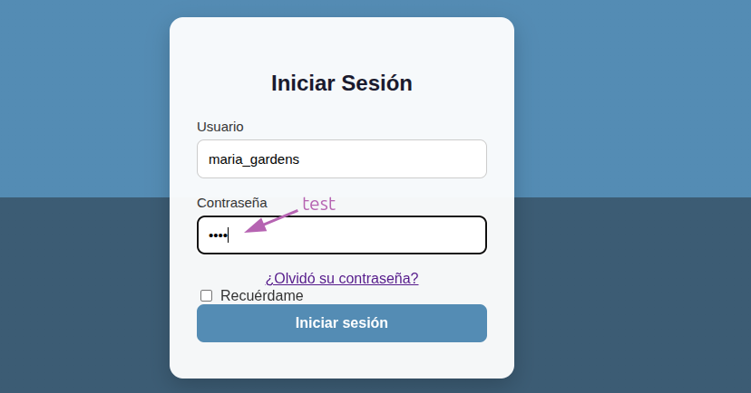

# TryAll-Regadio

temporal:  
mientras no se puede autenticar al sistema a traves de la base de datos mongoDB.  
se debe arrancar el backend con el comando `MODO_TEST=1 python manage.py runserver`.  

ingresar con las credenciales en MODO_TEST=1  
    - usuario: maria_gardens  
    - password: test  

## Base de datos

## Casos de uso

## Deployment
