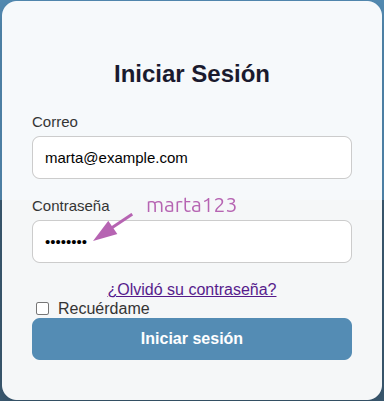

# TryAll-Regadio

## Requisitos

1. git
2. Node.js - angular 19 standalone (frontend)
3. mongoDB 7 (backend)
4. python 3.11.0 (backend)
5. En backend/regadio_backend/views.py se debe agregar una api key para poder usar la IA. Link: https://aistudio.google.com/app/apikey

## Instalacion

1. Clonar el repositorio
2. Arrancar el backend:
    1. ingresar a `./backend`
    2. crear, activar y actualizar entorno virtual (instrucciones detalladas en `backend/README.md`)
    3. agregar datos dummy a la base de datos (ejecutar `python database/agregar_datos_dummy.py`). Requiere entorno virtual activado
    4. arrancar backend `python regadio_backend/manage.py runserver` (realizar migraciones si es necesario, detalles en `regadio_backend/README.md`)
3. Arrancar el frontend:
    1. ingresar a `./frontend`
    2. `npm install`
    3. `ng serve` o `ng serve --open` para abrir en el navegador
    4. ingresar las credenciales de usuario

   * Credenciales dummy

        usuario:marta@example.com  
        password:marta123  

* credenciales validas despues de ejecutar `python backend/database/agregar_datos_dummy.py` desde la carpeta backend, con entorno virtual activado  

## Base de datos

## Casos de uso

## Deployment

