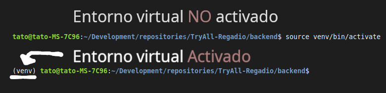

# regadio-backend

## 📑 Requisitos previos

1. **Python 3.11.0** instalado y con entorno virtual  
2. **Git**
3. **mongoDB** (en caso de no tener servidor remoto)  
    Seguir las instrucciones en `./database/README.md` para tener la base de datos funcionando de forma local
    y agregar datos dummy.


## 📦 Detalles de Instalacion
* Entorno virtual
  
  1. Crear entorno virtual
        ```bash
        python -m venv venv
        ```
  2. Activar entorno virtual
     
        **linux/macOS**  
        ```bash
        source venv/bin/activate
        ```

        **Windows**  
        ```bash
        source .venv/Scripts/activate
        venv\Scripts\activate
        ```

        **Windows (PowerShell)**  
        ```bash
        venv\Scripts\Activate.ps1
        ```
    
  3. Instalar dependencias
        ```bash
        pip install -r requirements.txt
        ```
        Para el login , si no funciona pip install django djangorestframework mongoengine bcrypt djangorestframework-simplejwt drf-yasg,pip install PyJWT


    
* mongoDB
  Detalles en `./database/README.md`
## Execution
Para ejecutar y trabajar con el proyecto, entrar al directorio  
`./regadio_backend/README.md` una vez que el entorno virutal este activado.